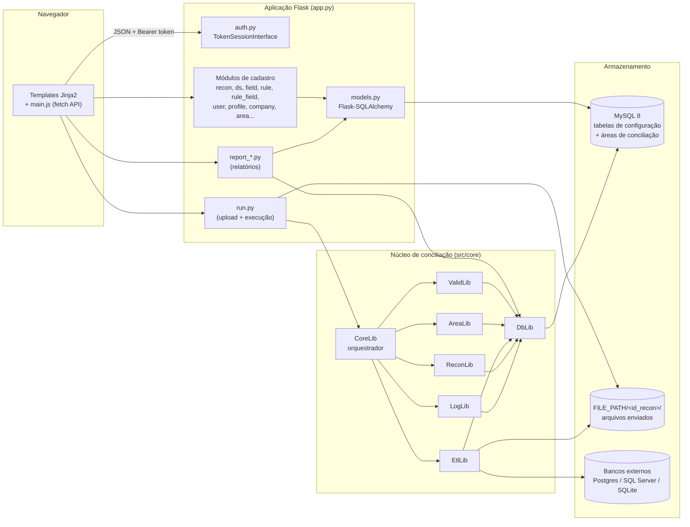
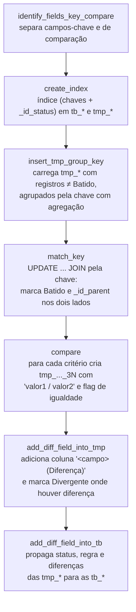
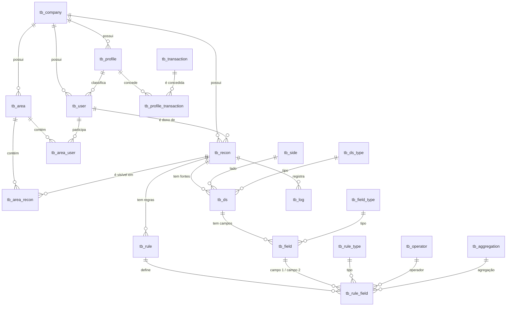

# Recon — Plataforma de Conciliação de Dados

O **Recon** é uma aplicação web para **conciliação de dados** entre duas fontes distintas (por exemplo, *saldos contábeis x extrato bancário*). O usuário configura as fontes de dados, mapeia os campos, define regras de batimento e executa o processo. O motor de conciliação importa os dados, cruza os registros pelas chaves configuradas, compara valores com tolerância e classifica cada registro como **Batido**, **Divergente** ou **Órfão**. Os resultados ficam disponíveis em relatórios de visão geral, sintético, analítico e de log.

A plataforma é **multiempresa** (*multi-tenant*), com controle de acesso por **perfil** (menus/transações) e segregação de visibilidade por **área** (restrição de *compliance* entre áreas).

---

## Sumário

1. [Visão geral da arquitetura](#1-visão-geral-da-arquitetura)
2. [Stack tecnológica](#2-stack-tecnológica)
3. [Estrutura de diretórios](#3-estrutura-de-diretórios)
4. [Conceitos de negócio](#4-conceitos-de-negócio)
5. [Motor de conciliação](#5-motor-de-conciliação)
6. [Modelo de dados](#6-modelo-de-dados)
7. [Autenticação, sessão e controle de acesso](#7-autenticação-sessão-e-controle-de-acesso)
8. [API REST](#8-api-rest)
9. [Front-end](#9-front-end)
10. [Configuração e variáveis de ambiente](#10-configuração-e-variáveis-de-ambiente)
11. [Instalação e execução local](#11-instalação-e-execução-local)
12. [Implantação (deploy)](#12-implantação-deploy)
13. [Guia rápido de uso](#13-guia-rápido-de-uso)
14. [Importação e exportação de conciliações](#14-importação-e-exportação-de-conciliações)
15. [Logs e diagnóstico](#15-logs-e-diagnóstico)
16. [Segurança e limitações conhecidas](#16-segurança-e-limitações-conhecidas)
17. [Convenções de desenvolvimento](#17-convenções-de-desenvolvimento)

---

## 1. Visão geral da arquitetura

A aplicação segue uma arquitetura em camadas, com separação clara entre a **camada web** (Flask + SQLAlchemy, responsável por cadastros, autenticação e relatórios) e o **núcleo de processamento** (`src/core`, que executa a conciliação com SQL dinâmico diretamente no MySQL).



**Princípios de projeto**

- **Registro de rotas por módulo:** cada arquivo em `src/web` expõe uma função `register(app)` que declara a página HTML e os endpoints `/api/...` correspondentes. O `app.py` apenas importa e registra os módulos.
- **Dois caminhos de acesso ao banco:** a camada web usa o ORM (Flask-SQLAlchemy + PyMySQL); o núcleo usa `mysql-connector-python` com SQL gerado dinamicamente, pois precisa criar e alterar tabelas em tempo de execução.
- **Áreas de conciliação físicas:** cada conciliação gera suas próprias tabelas de trabalho no MySQL (`tb_<empresa>_<conciliação>_<lado>`), o que permite estruturas de colunas diferentes por conciliação.

---

## 2. Stack tecnológica

| Camada | Tecnologia |
|---|---|
| Linguagem | Python 3.13 |
| Framework web | Flask |
| ORM | Flask-SQLAlchemy (SQLAlchemy 2.x, estilo `db.select`) |
| Banco principal | MySQL 8.0 (drivers `pymysql` para o ORM e `mysql-connector-python` para o núcleo) |
| Conectores ETL | `psycopg2` (PostgreSQL), `pyodbc` (SQL Server via *ODBC Driver 18*), `sqlite3` |
| Utilitários | `python-dateutil` (parsing de datas), `pconst` (constantes imutáveis), `itsdangerous` (tokens assinados) |
| Front-end | Jinja2, JavaScript puro (Fetch API), CSS próprio, fontes DM Sans / DM Mono |
| Hospedagem de produção | PythonAnywhere (WSGI) |

Dependências declaradas em [requirements.txt](requirements.txt).

---

## 3. Estrutura de diretórios

```
recon/
├── app.py                      # Ponto de entrada: cria o app Flask, configura DB e registra rotas
├── requirements.txt            # Dependências Python
├── etc/
│   ├── db/
│   │   ├── ddl.sql             # Criação das tabelas do sistema (MySQL)
│   │   └── dml.sql             # Carga inicial: domínios, empresa/usuários demo e menus
│   ├── demo/                   # Arquivos de exemplo (saldo.txt, extrato.txt)
│   ├── deploy.sh               # Script de atualização em produção (backup + git pull)
│   ├── docker.txt              # Comando para subir um MySQL 8 local via Docker
│   ├── venv.txt                # Exemplo de variáveis de ambiente
│   └── wsgi.py                 # Arquivo WSGI usado no PythonAnywhere
├── src/
│   ├── core/                   # Núcleo de conciliação (independente do Flask)
│   │   ├── corelib.py          # Orquestrador do processo de conciliação
│   │   ├── validlib.py         # Validações de pré-execução
│   │   ├── arealib.py          # Criação das áreas (tabelas) de conciliação
│   │   ├── etllib.py           # Importação de arquivos e bancos externos
│   │   ├── reconlib.py         # Batimento, comparação e marcação de status
│   │   ├── loglib.py           # Gravação de logs em tb_log e catálogo de mensagens
│   │   ├── dblib.py            # Acesso a banco (MySQL principal e conectores ETL)
│   │   ├── fslib.py            # Utilitários de sistema de arquivos
│   │   ├── baselib.py          # Classe base (nomenclatura de tabelas)
│   │   └── constlib.py         # Constantes do domínio (status, tipos, índices de colunas)
│   └── web/                    # Camada web (rotas Flask + ORM)
│       ├── models.py           # Modelos SQLAlchemy
│       ├── tokensession.py     # Sessão baseada em token (header), não em cookie
│       ├── access.py           # Regras de visibilidade por área
│       ├── auth.py             # Login, logout, usuário corrente e menu
│       ├── pages.py            # Página inicial e estatísticas
│       ├── company.py          # Empresas (inclui provisionamento de nova empresa)
│       ├── user.py, profile.py, transaction.py, profile_transaction.py
│       ├── area.py, area_user.py, area_recon.py
│       ├── recon.py            # Conciliações (CRUD, duplicar, importar, exportar)
│       ├── ds.py               # Fontes de dados (inclui teste de conexão)
│       ├── field.py            # Campos (layout) das fontes de dados
│       ├── rule.py             # Regras de batimento
│       ├── rule_field.py       # Definição de regras (pares de campos)
│       ├── run.py              # Execução (upload de arquivos + disparo do motor)
│       └── report_overview.py, report_sintetic.py, report_analitic.py, report_log.py
├── templates/                  # Páginas Jinja2 (uma por funcionalidade, herdando base.html)
├── static/
│   ├── css/style.css
│   └── js/main.js              # Cliente da API, sessão por token, tabelas, paginação, toasts
└── upload/                     # Diretório de arquivos enviados (FILE_PATH/<id_recon>/)
```

---

## 4. Conceitos de negócio

| Conceito | Descrição | Tabela |
|---|---|---|
| **Empresa** | Unidade de isolamento (*tenant*). Todo dado de negócio carrega `id_company`. | `tb_company` |
| **Perfil** | Conjunto de transações (itens de menu) acessíveis. Ex.: *Administrador*, *Usuário/Analista*. | `tb_profile` |
| **Transação** | Item de menu em árvore (`id_parent`), com `link` para a página. | `tb_transaction` |
| **Usuário** | Pertence a uma empresa e a um perfil. `username` é único por empresa. | `tb_user` |
| **Área** | Agrupamento organizacional para segregar conciliações entre equipes. | `tb_area` |
| **Conciliação** | Definição do processo de batimento entre dois lados. | `tb_recon` |
| **Lado** | *Lado 1* e *Lado 2* — as duas bases confrontadas. | `tb_side` |
| **Fonte de dados** | Origem dos dados de um lado: arquivo delimitado ou banco de dados. | `tb_ds` |
| **Campo** | Layout da fonte: posição (1-based), nome e tipo (*Inteiro*, *Decimal*, *Texto*, *Data*). | `tb_field` |
| **Regra** | Etapa de batimento. Uma conciliação pode ter várias regras, executadas em sequência. | `tb_rule` |
| **Definição de regra** | Par de campos (Lado 1 × Lado 2) com tipo, operador, tolerância e agregação. | `tb_rule_field` |

### Tipos de definição de regra

- **Chave de Batimento** (`id_rule_type = 1`): campos usados para localizar o registro correspondente no outro lado (ex.: agência + conta). Toda conciliação precisa de ao menos uma.
- **Critério de Comparação** (`id_rule_type = 2`): campos cujos valores são comparados depois que a chave casou (ex.: valor). Diferenças acima da tolerância geram divergência.

### Status de resultado

| Status | Código | Significado |
|---|---|---|
| **Batido** | 1 | Registro encontrou correspondente pela chave e não apresentou divergência nos critérios de comparação. |
| **Divergente** | 2 | Registro casou pela chave, mas ao menos um critério de comparação excedeu a tolerância. |
| **Órfão** | 3 | Registro sem correspondente no outro lado (status inicial de todos os registros). |

### Agregações

Quando há mais de um registro com a mesma chave, os dados são agrupados antes do batimento: **Somar** (`SUM`), **Máximo** (`MAX`), **Mínimo** (`MIN`) e **Média** (`AVG`). Sem agregação explícita, utiliza-se `MAX` (identidade quando a chave é 1:1 e compatível com `ONLY_FULL_GROUP_BY`). Não é permitido agregar nem aplicar tolerância a campos do tipo *Texto*.

---

## 5. Motor de conciliação

O processamento é disparado por `POST /api/run/<id_recon>` ([src/web/run.py](src/web/run.py)), que salva os arquivos enviados e chama `CoreLib().process(...)` ([src/core/corelib.py](src/core/corelib.py)).

### 5.1 Fluxo de execução

```mermaid
sequenceDiagram
    autonumber
    participant U as Usuário
    participant R as run.py
    participant C as CoreLib
    participant V as ValidLib
    participant A as AreaLib
    participant E as EtlLib
    participant X as ReconLib
    participant M as MySQL

    U->>R: POST /api/run/{id} (multipart: file_<id_ds>)
    R->>R: Salva arquivos em FILE_PATH/{id_recon}/
    R->>C: process(id_user, id_recon, id_company)
    C->>M: Abre conexão e transação; limpa logs da execução anterior
    C->>V: validate()
    C->>A: process() → cria tb_* e tmp_* por lado
    C->>E: process() → importa arquivos / bancos externos
    C->>X: process() → aplica cada regra em sequência
    C->>M: commit + log de tempo de processamento
    C-->>R: mensagem de sucesso ou erro
    R-->>U: { ok, message } / { ok: false, error }
```

### 5.2 Validação (`ValidLib`)

Antes de qualquer processamento são verificados, nesta ordem:

1. Variáveis de ambiente obrigatórias (`FILE_PATH`, `DB_HOSTNAME`, `DB_USERNAME`, `DB_PASSWORD`, `DB_NAME`);
2. Existência da conciliação;
3. Ao menos uma fonte de dados para **cada** lado;
4. Ao menos um campo mapeado em cada fonte;
5. Ao menos uma regra, contendo ao menos uma **Chave de Batimento**.

### 5.3 Áreas de conciliação (`AreaLib`)

Para cada lado, são criadas (após `DROP` das anteriores):

- uma tabela permanente `tb_<id_company>_<id_recon>_<lado>`, que guarda o resultado final;
- uma tabela `TEMPORARY` `tmp_<id_company>_<id_recon>_<lado>`, usada durante o batimento.

As colunas são os campos mapeados da(s) fonte(s) daquele lado, com tipos convertidos (`Inteiro → INTEGER`, `Decimal → DECIMAL(18,8)`, `Texto → VARCHAR(500)`, `Data → DATETIME`), precedidas das **colunas de controle**:

| Coluna | Descrição |
|---|---|
| `_id` | Chave primária auto-incremento |
| `_side` | Lado (1 ou 2) |
| `_id_company`, `_id_user` | Empresa e usuário que executaram |
| `_date` | Data/hora da carga |
| `_id_parent` | `_id` do registro correspondente no outro lado (removida ao final) |
| `_recon`, `_id_recon` | Nome e id da conciliação |
| `_rule` | Nome da regra que bateu o registro |
| `_id_status`, `_status` | Status numérico e textual (inicia como `3` / `Órfão`) |

Em caso de erro em qualquer etapa, as tabelas `tb_*` da conciliação são removidas.

### 5.4 Importação (`EtlLib`)

**Arquivo delimitado** (`id_type = 1`)

- Caminho: `FILE_PATH/<id_recon>/<filename>` (o *upload* grava com o `filename` configurado na fonte).
- A **primeira linha é tratada como cabeçalho** e ignorada; linhas vazias também.
- Cada linha é dividida pelo delimitador configurado; o valor de cada campo é obtido pela sua `position` (base 1).
- Codificação esperada: **UTF-8**.

**Banco de dados externo**

- Credenciais no formato `host; usuário; senha; banco`.
- A `query` configurada é executada na origem, e as colunas do resultado são mapeadas por posição.
- Conectores disponíveis em `DbLib`: MySQL, PostgreSQL, SQL Server (ODBC Driver 18) e SQLite (neste caso, `credentials` é o caminho do arquivo).

**Normalização de tipos**

| Tipo | Regra | Valor em caso de falha |
|---|---|---|
| Inteiro | `int()`; aceita também valores decimais | `0` |
| Decimal | Se contiver vírgula, trata como formato brasileiro (`1.234,56 → 1234.56`) | `0` |
| Data | `dateutil` com `dayfirst=True`, gravado como `YYYY-MM-DD HH:MM:SS` | `1900-01-01` |
| Texto | `strip()` | — |

A inserção é feita em lotes de **1.000 registros** (`executemany`).

### 5.5 Batimento (`ReconLib`)

As regras de uma conciliação são processadas **em cascata**: cada regra atua apenas sobre registros ainda não batidos pelas regras anteriores. Para cada regra:



Ao final de todas as regras: grava `_id_user`/`_id_company` nas tabelas finais, remove as tabelas temporárias e a coluna `_id_parent`.

**Critérios de igualdade**

- Chave sem tolerância e não decimal: igualdade exata (`=`).
- Chave decimal ou com tolerância: `ABS(ROUND(v1 - v2, 8)) <= tolerância`.
- Critério de comparação: `ABS(ROUND(v1 - v2, 8)) <= tolerância` (tolerância padrão `0`). O arredondamento em 8 casas evita mascarar divergências decimais finas.

**Resultado:** as tabelas `tb_<empresa>_<conciliação>_1` e `_2` contêm todos os registros importados com o status, a regra aplicada e, para divergentes, colunas `"<campo> (Diferença)"` no formato `valor_lado1 / valor_lado2`.

### 5.6 Transação e concorrência

Cada execução abre uma conexão própria e uma transação com isolamento `READ UNCOMMITTED`. Observe que comandos DDL no MySQL (`CREATE`/`ALTER`/`DROP TABLE`) provocam *commit* implícito — portanto, a execução **não é atômica** e reexecuções recriam integralmente as áreas de conciliação.

---

## 6. Modelo de dados

O script completo está em [etc/db/ddl.sql](etc/db/ddl.sql). Todas as tabelas usam InnoDB, e a maior parte das chaves estrangeiras tem `ON DELETE CASCADE`.



### Tabelas de domínio (carga em `dml.sql`)

| Tabela | Valores |
|---|---|
| `tb_side` | 1 Lado 1 · 2 Lado 2 |
| `tb_ds_type` | 1 Arquivo · 2 Json · 3 Mysql · 4 Postgres · 5 Sql Server · 6 Oracle · 7 SQLite |
| `tb_field_type` | 1 Inteiro · 2 Decimal · 3 Texto · 4 Data |
| `tb_rule_type` | 1 Chave de Batimento · 2 Critério de Comparação |
| `tb_operator` | `=`, `<>`, `>`, `>=`, `<`, `<=` |
| `tb_aggregation` | 1 Somar · 2 Máximo · 3 Mínimo · 4 Média |

### Geração de identificadores

As chaves primárias **não** são auto-incremento: a camada web calcula o próximo id com `MAX(id) + 1` (função `next_id` em [src/web/models.py](src/web/models.py)).

### Tabelas dinâmicas

Além do esquema fixo, o motor cria em tempo de execução:

- `tb_<id_company>_<id_recon>_1` e `tb_<id_company>_<id_recon>_2` — resultados persistentes;
- `tmp_<id_company>_<id_recon>_<n>` — tabelas de trabalho, removidas ao final.

Ao excluir uma empresa, as tabelas dinâmicas das suas conciliações também são removidas.

---

## 7. Autenticação, sessão e controle de acesso

### 7.1 Login

`POST /api/auth/login` recebe `company_code` (id da empresa), `username` e `password`. O `username` é normalizado para minúsculas e é único dentro da empresa.

### 7.2 Sessão por token (por aba)

A aplicação substitui a sessão por cookie do Flask por uma **sessão baseada em token assinado** ([src/web/tokensession.py](src/web/tokensession.py)):

- O servidor serializa a sessão com `itsdangerous.URLSafeTimedSerializer` (chave `app.secret_key`, *salt* `recon-auth-token`) e devolve o token no cabeçalho de resposta **`X-Auth-Token`**.
- O cliente armazena o token em `sessionStorage` e o envia em cada requisição no cabeçalho **`Authorization: Bearer <token>`**.
- Validade do token: **8 horas**.
- Como `sessionStorage` é isolado por aba, é possível manter abas simultâneas logadas em **empresas diferentes**.
- Respostas de `/api/*` são enviadas com `Cache-Control: no-store`.

### 7.3 Menus por perfil

`GET /api/auth/menu` retorna as transações (`tb_transaction`) concedidas ao perfil do usuário via `tb_profile_transaction`. O front-end monta o menu hierárquico a partir de `id_parent`.

Ao criar uma empresa, o sistema a provisiona automaticamente com:

- perfil **Administrador** — todas as transações, exceto *Empresa* e *Transação* (reservadas à empresa principal);
- perfil **Usuário** — *Executar* e relatórios *Sintético*, *Analítico* e *Logs*;
- usuário `admin` com perfil Administrador.

### 7.4 Escopo dos dados

| Escopo | Regra |
|---|---|
| **Empresa** | Todas as consultas filtram pelo `company_id` da sessão. |
| **Configuração** (conciliação, fontes, campos, regras) | Apenas o **usuário criador** da conciliação (`tb_recon.id_user`) pode listar e editar sua configuração. |
| **Execução e relatórios** | Governados por **áreas** ([src/web/access.py](src/web/access.py)): o usuário enxerga uma conciliação somente se ela estiver vinculada (`tb_area_recon`) a uma área da qual ele participa (`tb_area_user`). |

Regras automáticas de área:

- ao criar/duplicar/importar uma conciliação, ela é vinculada a todas as áreas do criador;
- ao criar uma área, todos os usuários *Administrador* da empresa são incluídos nela;
- ao criar/alterar um usuário com perfil *Administrador*, ele é incluído em todas as áreas da empresa.

---

## 8. API REST

Todas as rotas `/api/*` trocam JSON (exceto o disparo da execução, que aceita `multipart/form-data`). Erros seguem o formato `{"error": "mensagem"}` com os códigos `400` (validação), `401` (não autenticado), `404` (não encontrado/sem acesso), `409` (duplicidade) e `500` (erro interno).

### Autenticação

| Método | Rota | Descrição |
|---|---|---|
| POST | `/api/auth/login` | Autentica (`company_code`, `username`, `password`) |
| POST | `/api/auth/logout` | Encerra a sessão |
| GET | `/api/auth/me` | Dados do usuário autenticado |
| GET | `/api/auth/menu` | Transações do perfil do usuário |
| GET | `/api/company/search?q=` | Busca empresas pelo nome (mín. 2 caracteres) |

### Cadastros

Os recursos abaixo seguem o mesmo padrão de rotas:

| Recurso | Página | Rotas |
|---|---|---|
| Conciliação | `/recon` | `GET/POST /api/recon` · `PUT/DELETE /api/recon/<id>` · `POST /api/recon/<id>/duplicate` · `GET /api/recon/<id>/export` · `POST /api/recon/import` |
| Fonte de dados | `/ds` | `GET /api/ds/options` · `GET/POST /api/ds` · `PUT/DELETE /api/ds/<id>` · `POST /api/ds/<id>/duplicate` · `POST /api/ds/test` |
| Campos | `/field` | `GET /api/field/options` · `GET/POST /api/field` · `PUT/DELETE /api/field/<id>` · `POST /api/field/<id>/duplicate` |
| Regras | `/rule` | `GET /api/rule/options` · `GET/POST /api/rule` · `PUT/DELETE /api/rule/<id>` · `POST /api/rule/<id>/duplicate` |
| Definição de regras | `/rule_field` | `GET /api/rule_field/options` · `GET/POST /api/rule_field` · `PUT/DELETE /api/rule_field/<id>` · `POST /api/rule_field/<id>/duplicate` |
| Usuários | `/user` | `GET /api/user/options` · `GET/POST /api/user` · `PUT/DELETE /api/user/<id>` · `POST /api/user/<id>/duplicate` |
| Perfis | `/profile` | `GET/POST /api/profile` · `GET/PUT/DELETE /api/profile/<id>` · `POST /api/profile/<id>/duplicate` |
| Transações | `/transaction` | `GET /api/transaction/options` · `GET/POST /api/transaction` · `PUT/DELETE /api/transaction/<id>` · `POST /api/transaction/<id>/duplicate` |
| Perfil × Transação | `/profile_transaction` | `GET /api/profile_transaction/options` · `GET/POST /api/profile_transaction` · `PUT /api/profile_transaction/sync` · `PUT/DELETE /api/profile_transaction/<id>` |
| Empresas | `/company` | `GET/POST /api/company` · `PUT/DELETE /api/company/<id>` · `POST /api/company/<id>/duplicate` |
| Áreas | `/area` | `GET/POST /api/area` · `GET/PUT/DELETE /api/area/<id>` · `POST /api/area/<id>/duplicate` |
| Área × Usuário | `/area_user` | `GET /api/area_user/options` · `GET /api/area_user` · `PUT /api/area_user/sync` · `DELETE /api/area_user/<id>` |
| Área × Conciliação | `/area_recon` | `GET /api/area_recon/options` · `GET /api/area_recon` · `PUT /api/area_recon/sync` · `DELETE /api/area_recon/<id>` |

Observações:

- **Exclusões em cascata:** excluir uma conciliação remove suas regras, definições, fontes, campos e logs; excluir uma fonte remove seus campos e as definições de regra que os referenciam.
- **Empresa padrão:** a empresa de código `1` não pode ser excluída.
- **Teste de conexão** (`POST /api/ds/test`): aceita uma URL SQLAlchemy completa ou credenciais `host; usuário; senha; banco` (interpretadas como MySQL) e executa `SELECT 1` ou a query informada.

### Execução

| Método | Rota | Descrição |
|---|---|---|
| GET | `/api/run/options` | Conciliações visíveis ao usuário |
| GET | `/api/run/<id_recon>/ds` | Fontes que exigem arquivo, para montar o formulário de upload |
| POST | `/api/run/<id_recon>` | Envia arquivos (campos `file_<id_ds>`) e executa a conciliação |

Exemplo:

```bash
curl -X POST http://localhost:5000/api/run/1 \
  -H "Authorization: Bearer <token>" \
  -F "file_1=@etc/demo/saldo.txt" \
  -F "file_2=@etc/demo/extrato.txt"
```

```json
{ "ok": true, "message": "Conciliação executada com sucesso" }
```

### Relatórios

| Página | Rota da API | Conteúdo |
|---|---|---|
| `/report_overview` | `GET /api/report_overview` | Totais de Batido/Divergente/Órfão e a conciliação com maior volume em cada status |
| `/report_sintetic` | `GET /api/report_sintetic` | Contagem por conciliação × lado × status, com data da última execução |
| `/report_analitic` | `GET /api/report_analitic/<id_recon>` | Registros de cada lado com status, regra e colunas de diferença (colunas técnicas ocultas) |
| `/report_log` | `GET /api/report_log` | Log de execução (usuário, conciliação, nível, classe, método, mensagem) |

---

## 9. Front-end

- **Renderização:** cada página é um template Jinja2 que estende [templates/base.html](templates/base.html) (layout, menu lateral e modais comuns). A lógica de cada tela fica em um bloco `<script>` do próprio template.
- **Biblioteca comum:** [static/js/main.js](static/js/main.js) concentra o cliente HTTP (`apiFetch`, que injeta o token e captura o `X-Auth-Token` renovado), controle de login, paginação (tamanho de página salvo em `localStorage`), seleção de linhas e notificações (*toasts*).
- **Estilo:** [static/css/style.css](static/css/style.css), sem frameworks de UI externos.
- **Idioma da interface:** português do Brasil.

---

## 10. Configuração e variáveis de ambiente

| Variável | Obrigatória | Descrição |
|---|---|---|
| `DB_HOSTNAME` | Sim | Host do MySQL |
| `DB_USERNAME` | Sim | Usuário do MySQL |
| `DB_PASSWORD` | Sim | Senha do MySQL |
| `DB_NAME` | Sim | Nome do banco |
| `FILE_PATH` | Sim | Diretório raiz dos arquivos enviados (cada conciliação usa `FILE_PATH/<id_recon>/`) |

**Carregamento:** ao iniciar, o [app.py](app.py) lê o arquivo opcional `etc/environment.txt` (formato `export CHAVE=valor`, ignorado pelo Git) e define as variáveis **que ainda não existirem** no ambiente (`os.environ.setdefault`). Em produção, as variáveis são definidas no arquivo WSGI.

Exemplo de `etc/environment.txt`:

```bash
export DB_HOSTNAME=localhost
export DB_USERNAME=root
export DB_PASSWORD=admin
export DB_NAME=recon
export FILE_PATH=C:/Users/<usuario>/Git/recon/upload
```

**Fuso horário:** as conexões com o MySQL são abertas com `time_zone = '-03:00'` (ORM e núcleo) e o WSGI de produção define `TZ=America/Sao_Paulo`.

---

## 11. Instalação e execução local

### Pré-requisitos

- Python 3.13+
- MySQL 8.0 (local ou via Docker)
- *(Opcional)* Microsoft ODBC Driver 18 for SQL Server, para fontes SQL Server

### Passo a passo

**1. Clonar e criar o ambiente virtual**

```bash
git clone <url-do-repositorio> recon
cd recon
python -m venv .venv
# Windows
.venv\Scripts\activate
# Linux/macOS
source .venv/bin/activate
pip install -r requirements.txt
```

**2. Subir o MySQL** (conforme [etc/docker.txt](etc/docker.txt))

```bash
docker run --name mysql8 \
  -e MYSQL_ROOT_PASSWORD=admin \
  -p 3306:3306 \
  -v mysql8_data:/var/lib/mysql \
  -d mysql:8.0 \
  --default-authentication-plugin=mysql_native_password
```

**3. Criar o banco e carregar o esquema**

```bash
mysql -h 127.0.0.1 -u root -p -e "CREATE DATABASE recon CHARACTER SET utf8mb4;"
mysql -h 127.0.0.1 -u root -p recon < etc/db/ddl.sql
mysql -h 127.0.0.1 -u root -p recon < etc/db/dml.sql
```

**4. Configurar as variáveis de ambiente** em `etc/environment.txt` (ver [seção 10](#10-configuração-e-variáveis-de-ambiente)).

**5. Executar**

```bash
python app.py
```

A aplicação sobe em `http://127.0.0.1:5000` em modo *debug*.

### Credenciais de demonstração (carga `dml.sql`)

| Empresa | Usuário | Senha | Perfil |
|---|---|---|---|
| 1 (Recon) | `admin` | `admin` | Administrador |
| 1 (Recon) | `demo` | `demo` | Analista |

A carga também cria a conciliação de exemplo **"Saldos x Extrato"**, que pode ser executada com os arquivos de [etc/demo/](etc/demo/).

---

## 12. Implantação (deploy)

O ambiente de produção é o **PythonAnywhere**, com o código em `/home/dlancioni/www/recon`.

- **WSGI:** [etc/wsgi.py](etc/wsgi.py) define o fuso horário, as variáveis de ambiente, inclui o projeto no `sys.path` e expõe `application` a partir de `app.py`.
- **Atualização:** [etc/deploy.sh](etc/deploy.sh), executado a partir de `/home/dlancioni/`:
  1. copia a versão atual para `/home/dlancioni/bkp/recon_<AAAAMMDD_HHMM>` (backup);
  2. executa `git pull` no repositório;
  3. remove a pasta `etc/` do diretório publicado;
  4. remove as pastas `__pycache__`.
- Após o script, recarregue a aplicação web no painel do PythonAnywhere.
- Alterações de esquema devem ser aplicadas manualmente no banco de produção (não há ferramenta de migração).

---

## 13. Guia rápido de uso

1. **Conciliações → Configurar → Conciliação:** cadastre a conciliação (nome e descrição).
2. **Fonte de Dados:** cadastre uma fonte para o *Lado 1* e outra para o *Lado 2*, informando tipo, nome do arquivo e delimitador (ou credenciais e query, para bancos).
3. **Campos:** mapeie os campos de cada fonte (posição, nome e tipo). Campos equivalentes nos dois lados podem ter nomes diferentes.
4. **Regras:** crie uma ou mais regras (serão aplicadas em cascata).
5. **Definição de Regras:** para cada regra, associe pares de campos Lado 1 × Lado 2 como *Chave de Batimento* ou *Critério de Comparação*, com tolerância e agregação quando aplicável.
6. **Organização → Área × Conciliação:** garanta que a conciliação esteja vinculada às áreas que devem visualizá-la.
7. **Conciliações → Executar:** selecione a conciliação, envie os arquivos e execute.
8. **Resultados:** acompanhe em *Visão Geral*, *Sintético*, *Analítico* e *Logs*.

---

## 14. Importação e exportação de conciliações

`GET /api/recon/<id>/export` gera um JSON autocontido com toda a configuração, que pode ser reimportado (inclusive em outra empresa) via `POST /api/recon/import`. As referências usam **nomes** (não ids), e os campos são identificados como `"<nome da fonte> / <nome do campo>"`.

```json
{
  "name": "Saldos x Extrato",
  "description": "Conciliação para demonstração",
  "datasources": [
    {
      "name": "Saldos", "side": "Lado 1", "type": "Arquivo",
      "filename": "saldo.txt", "delimiter": ";",
      "credentials": "", "query": "", "url": "",
      "fields": [
        { "position": 1, "name": "Agencia", "type": "Inteiro", "value": "" },
        { "position": 3, "name": "Valor",   "type": "Decimal", "value": "" }
      ]
    }
  ],
  "rules": [
    {
      "name": "Batimento de arquivos",
      "rule_fields": [
        { "type": "Chave de Batimento", "field_1": "Saldos / Agencia", "operator": "=",
          "field_2": "Extrato / Agencia", "aggregation": "", "tolerance": 0 },
        { "type": "Critério de Comparação", "field_1": "Saldos / Valor", "operator": "=",
          "field_2": "Extrato / Valor", "aggregation": "Somar", "tolerance": 0.01 }
      ]
    }
  ]
}
```

A importação é transacional: se algum campo referenciado não existir, nada é gravado e a API retorna `400`.

---

## 15. Logs e diagnóstico

- Cada execução apaga os logs anteriores do par usuário × conciliação e registra novas entradas em `tb_log` (`INFO`/`ERROR`, classe, método, mensagem e data/hora).
- Mensagens padronizadas ficam em `LogLib.get_message` ([src/core/loglib.py](src/core/loglib.py)); códigos livres (15–50) estão reservados para novas mensagens.
- O último registro de log define a **data de execução** exibida nos relatórios.
- O tempo total de processamento é registrado ao final de cada execução.
- A consulta é feita pela tela **Resultados → Logs**.

---

## 16. Segurança e limitações conhecidas

Pontos a tratar antes de expor a aplicação a ambientes de maior criticidade:

**Segurança**

- **Senhas em texto puro** em `tb_user.password`. Recomenda-se *hash* com `werkzeug.security` ou `bcrypt`.
- **`secret_key` fixa no código** ([app.py](app.py)). Deve ser lida de variável de ambiente, pois assina os tokens de sessão.
- **Credenciais versionadas:** o arquivo [etc/wsgi.py](etc/wsgi.py) contém credenciais do banco de produção. Recomenda-se movê-las para variáveis de ambiente do servidor, rotacionar a senha e remover o arquivo do histórico do Git.
- **Credenciais de fontes de dados** são armazenadas em texto puro em `tb_ds.credentials`.
- **SQL dinâmico:** o núcleo monta SQL por interpolação de strings (nomes de campos, regras e ids). Nomes de campos e regras vêm do cadastro do usuário e devem ser validados/escapados.
- **Autorização por perfil apenas no menu:** o perfil controla os itens exibidos, mas os endpoints verificam somente autenticação e escopo de empresa/dono. As rotas de **Empresa** e **Transação** não exigem autenticação.
- **Upload:** o nome de destino vem do cadastro da fonte; recomenda-se sanitizá-lo (ex.: `werkzeug.utils.secure_filename`).

**Limitações funcionais**

- Os tipos **Json** e **Oracle** estão cadastrados em `tb_ds_type`, mas não têm importação implementada.
- Há divergência de numeração entre `constlib.DATASOURCE_*` e `tb_ds_type`: o id `3` (Mysql) coincide com `DATASOURCE_API`, o que faz a `EtlLib` ignorar fontes do tipo Mysql. Recomenda-se alinhar as constantes com a tabela de domínio.
- O campo **operador** é armazenado, mas o motor sempre compara por igualdade/tolerância.
- Geração de ids por `MAX(id) + 1` pode gerar conflito sob concorrência.
- Os modelos `Layout` e `Campo` (e as rotas genéricas `/api/<section>`) são legados e não possuem tabelas no `ddl.sql`.
- Não há suíte de testes automatizados nem ferramenta de migração de esquema.

---

## 17. Convenções de desenvolvimento

- **Novo módulo web:** crie `src/web/<recurso>.py` com `register(app)`, o template `templates/<recurso>.html` estendendo `base.html`, registre-o em [app.py](app.py) e cadastre a transação correspondente em `tb_transaction`/`tb_profile_transaction` para que apareça no menu.
- **Proteção de rotas:** verifique `'user_id' in session` e filtre sempre por `session['company_id']`; para dados de conciliação, aplique `get_visible_recon_ids` (execução/relatórios) ou o filtro de dono (configuração).
- **Novos ids:** use `next_id(Model)`.
- **Núcleo:** as classes de `src/core` recebem a conexão (`cn`) no construtor, registram erros via `LogLib` e propagam exceções com mensagem legível ao usuário. Índices de colunas das consultas estão centralizados em [src/core/constlib.py](src/core/constlib.py).
- **Mensagens e interface:** em português do Brasil.
